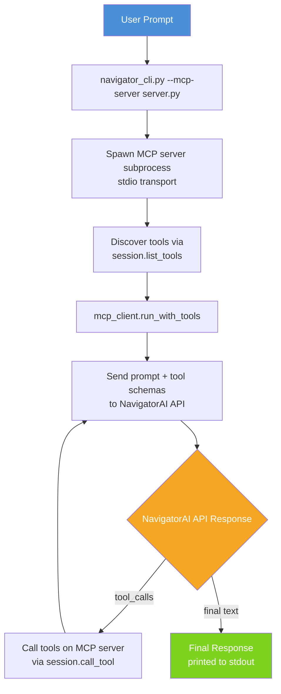

# NavigatorAI CLI

[](https://github.com/cegme/navigator-cli/actions/workflows/ci.yml)
[](https://www.python.org/downloads/)
[](https://www.gnu.org/licenses/gpl-3.0)
[](https://docs.astral.sh/uv/)

A command-line tool for querying [NavigatorAI](https://it.ufl.edu/ai) LLMs using Python and uv.
The CLI supports direct prompting, Chain-of-Thought reasoning, custom system prompts, model selection, and MCP tool integration.

## Links

- [NavigatorAI Portal](https://it.ufl.edu/ai) - UF's AI platform
- [Navigator Toolkit Documentation](https://docs.ai.it.ufl.edu/) - API documentation
- [Function Calling](https://docs.ai.it.ufl.edu/docs/navigator_toolkit/capabilities/function_calling) - Function calling documentation
- [NavigatorAI Chat](https://chat.ai.it.ufl.edu/) - Web interface
- [Model Context Protocol](https://modelcontextprotocol.io/) - MCP specification

## Setup

```bash
git clone https://github.com/cegme/navigator-cli.git
cd navigator-cli/

# Copy the environment template and add your API key
cp .env.example .env
# Edit .env and add your NAVIGATOR_API_KEY

# Sync dependencies (uv will create a virtual environment)
uv sync
```

## Get Your API Key

1. Go to https://it.ufl.edu/ai
2. Log in with your GatorLink credentials
3. Navigate to Navigator Toolkit, then API Keys
4. Create a new API key and copy it to your `.env` file

## Usage

The CLI can be run as a script or as a module:

```bash
uv run python navigator_cli.py "What is the capital of France?"
uv run python -m navigator_cli "What is the capital of France?"
```

### Basic Query

```bash
uv run python -m navigator_cli "What is the capital of France?"
```

### Chain-of-Thought Prompting

The `--cot` flag appends "Let's think step by step." to the prompt, triggering the LLM to show its reasoning before answering.

```bash
uv run python -m navigator_cli --cot \
    "If I have 5 apples and buy 3 more bags with 4 apples each, how many apples do I have?"
```

### Custom System Prompt

The `--system` (or `-s`) flag sets a system message that provides context or a persona for the LLM.

```bash
uv run python -m navigator_cli \
    --system "You are a data engineer" \
    "How do I clean messy CSV data?"
```

### Model Selection

Use `--model` (or `-m`) to choose a specific model. The default is `gpt-4o`. Run `--list-models` to see all available models.

```bash
# GPT-4o-mini for faster responses
uv run python -m navigator_cli --model gpt-4o-mini "Quick question"

# Claude
uv run python -m navigator_cli --model claude-3-5-sonnet "Explain Python decorators"
```

### Temperature Control

The `--temperature` (or `-t`) flag controls randomness. Values range from 0.0 (deterministic) to 2.0 (most random). The default is 0.7.

```bash
# Low temperature for factual answers
uv run python -m navigator_cli -t 0.0 "What year was Python created?"

# High temperature for creative writing
uv run python -m navigator_cli -t 1.5 "Write a haiku about data pipelines"
```

### Reading from Stdin

The `--stdin` flag reads the prompt from standard input instead of a positional argument. This is useful for piping content from files or other commands.

```bash
echo "Explain recursion in simple terms" | uv run python -m navigator_cli --stdin

# Pipe a file as the prompt
cat prompt.txt | uv run python -m navigator_cli --stdin
```

### Listing Available Models

```bash
uv run python -m navigator_cli --list-models
```

This prints a table of model IDs, owners, and creation dates.

### Verbose and Quiet Modes

Verbose mode (`-v`) enables debug logging to stdout, showing request details, timing, and prompt information. Quiet mode (`-q`) suppresses all output except the LLM response.

```bash
# See debug details
uv run python -m navigator_cli -v "Debug this query"

# Only the response, no metadata
uv run python -m navigator_cli -q "Just the answer please"
```

### Combining Flags

Flags can be combined freely. Here is an example using a system prompt, Chain-of-Thought, a specific model, and low temperature together:

```bash
uv run python -m navigator_cli \
    --system "You are a data quality analyst" \
    --cot \
    --model gpt-4o \
    -t 0.3 \
    "Given this record, identify all validation errors:
Schema: email (valid format), age (0-120), date (YYYY-MM-DD, not future)
Record: {\"email\": \"john@\", \"age\": \"25\", \"date\": \"2030-01-15\"}"
```

## MCP Tool Integration

The CLI supports [Model Context Protocol (MCP)](https://modelcontextprotocol.io/) servers via the `--mcp-server` flag. MCP allows the LLM to call external tools during a conversation, giving it access to capabilities beyond text generation.

### How MCP Tool Calling Works

The tool-calling flow has four steps:

1. The CLI spawns the MCP server as a subprocess and discovers its available tools.
2. The user's prompt and the tool definitions are sent to the NavigatorAI API.
3. If the LLM decides a tool is needed, the CLI calls the tool on the MCP server and sends the result back to the LLM.
4. Steps 2-3 repeat until the LLM produces a final text answer. A safety limit of 5 rounds prevents infinite loops.

### Included Example: CSV Tools Server

The `mcp_servers/csv_tools.py` server provides three tools for working with CSV files:

| Tool | Description |
|------|-------------|
| `read_csv_file` | Read a CSV file and return its contents as formatted text |
| `csv_stats` | Compute count, mean, median, min, max, and stdev for a numeric column |
| `count_rows` | Count the number of data rows (excluding the header) |

A sample dataset is included at `mcp_servers/sample_data.csv` with 5 rows and 4 columns (name, age, score, city).

### MCP Examples

```bash
# Ask the LLM to analyze a CSV file
uv run python -m navigator_cli \
    --mcp-server mcp_servers/csv_tools.py \
    "What is the average score in mcp_servers/sample_data.csv?"

# Combine MCP with a system prompt
uv run python -m navigator_cli \
    --mcp-server mcp_servers/csv_tools.py \
    --system "You are a data analyst. Be concise." \
    "How many rows are in mcp_servers/sample_data.csv and what city has the highest score?"

# Use verbose mode to see each tool call and its result
uv run python -m navigator_cli -v \
    --mcp-server mcp_servers/csv_tools.py \
    "Summarize the data in mcp_servers/sample_data.csv"

# Combine MCP with Chain-of-Thought
uv run python -m navigator_cli \
    --mcp-server mcp_servers/csv_tools.py \
    --cot \
    "Read mcp_servers/sample_data.csv and determine which person has the highest score relative to their age"

# Use a different model with MCP tools
uv run python -m navigator_cli \
    --mcp-server mcp_servers/csv_tools.py \
    --model gpt-4o-mini \
    "What are the statistics for the age column in mcp_servers/sample_data.csv?"
```

<details>
<summary><h3>Writing Your Own MCP Server</h3></summary>

Create a Python script that uses `FastMCP` to define tools. Each function decorated with `@mcp.tool()` becomes available to the LLM. The function's docstring is sent to the LLM as the tool description, so write it clearly.

```python
from mcp.server.fastmcp import FastMCP

mcp = FastMCP("my-tools")

@mcp.tool()
def lookup_weather(city: str) -> str:
    """Look up the current weather for a city.

    Args:
        city: The city name to check weather for.
    """
    # Your implementation here
    return f"The weather in {city} is sunny, 72F."

@mcp.tool()
def convert_units(value: float, from_unit: str, to_unit: str) -> str:
    """Convert a value between measurement units.

    Args:
        value: The numeric value to convert.
        from_unit: The source unit (e.g., 'km', 'miles').
        to_unit: The target unit (e.g., 'km', 'miles').
    """
    # Your implementation here
    return f"{value} {from_unit} = {value * 1.60934} {to_unit}"

if __name__ == "__main__":
    mcp.run(transport="stdio")
```

Run it with the CLI:

```bash
uv run python -m navigator_cli \
    --mcp-server my_server.py \
    "What is the weather in Gainesville?"
```

</details>

<details>
<summary><h3>MCP Architecture</h3></summary>



</details>

<details>
<summary><h2>Options Reference</h2></summary>

| Option | Short | Default | Description |
|--------|-------|---------|-------------|
| `prompt` | | | The prompt to send to the LLM (positional argument) |
| `--cot` | | off | Append "Let's think step by step." to enable Chain-of-Thought |
| `--system` | `-s` | none | System prompt to set context or persona |
| `--model` | `-m` | `gpt-4o` | Model to use for generation |
| `--temperature` | `-t` | `0.7` | Sampling temperature from 0.0 to 2.0 |
| `--list-models` | `-l` | | List all available models and exit |
| `--mcp-server` | | none | Path to an MCP server script to enable tool use |
| `--stdin` | | off | Read the prompt from stdin instead of a positional argument |
| `--verbose` | `-v` | off | Enable debug logging to stdout |
| `--quiet` | `-q` | off | Suppress all output except the LLM response |

</details>

## Project Structure

```
navigator-cli/
├── navigator_cli.py          # Main CLI entry point
├── mcp_client.py             # MCP client: tool discovery and tool-call loop
├── mcp_servers/
│   ├── __init__.py
│   ├── csv_tools.py          # Example MCP server with CSV tools
│   └── sample_data.csv       # Sample dataset (5 rows: name, age, score, city)
├── tests/
│   ├── test_navigator_cli.py # Tests for core CLI and query_llm
│   ├── test_mcp_client.py    # Tests for MCP client functions
│   └── test_csv_tools.py     # Tests for CSV tool functions
├── pyproject.toml            # Project config and dependencies
├── .env.example              # Environment variable template
└── README.md
```

## Examples for Class Demo

### Compare Zero-Shot vs Chain-of-Thought

```bash
# Zero-shot (direct answer)
uv run python -m navigator_cli \
    "Roger has 5 tennis balls. He buys 2 cans with 3 balls each. How many balls does he have?"

# Chain-of-Thought (step by step reasoning)
uv run python -m navigator_cli --cot \
    "Roger has 5 tennis balls. He buys 2 cans with 3 balls each. How many balls does he have?"
```

### System Prompt Effects

```bash
# No system prompt
uv run python -m navigator_cli "How should I store timestamps?"

# With a data engineering persona
uv run python -m navigator_cli \
    --system "You are a senior data engineer at a large company" \
    "How should I store timestamps?"
```

### Data Validation with CoT

```bash
uv run python -m navigator_cli \
    --system "You are a data quality analyst" \
    --cot \
    "Given this record, identify all validation errors:
Schema: email (valid format), age (0-120), date (YYYY-MM-DD, not future)
Record: {\"email\": \"john@\", \"age\": \"25\", \"date\": \"2030-01-15\"}"
```

### MCP Tool Use Demo

```bash
# The LLM reads a real CSV file and answers questions about it
uv run python -m navigator_cli \
    --mcp-server mcp_servers/csv_tools.py \
    "Read mcp_servers/sample_data.csv and tell me who has the highest score"

# Verbose mode shows each tool call the LLM makes
uv run python -m navigator_cli -v \
    --mcp-server mcp_servers/csv_tools.py \
    "Get the statistics for the score column in mcp_servers/sample_data.csv"
```

## Running Tests

```bash
# Install dev dependencies
uv sync

# Run all tests
uv run pytest

# Run with verbose output
uv run pytest -v

# Run tests for a specific module
uv run pytest tests/test_navigator_cli.py -v
uv run pytest tests/test_mcp_client.py -v
uv run pytest tests/test_csv_tools.py -v

# Run a specific test class
uv run pytest tests/test_navigator_cli.py::TestQueryLLM -v
uv run pytest tests/test_csv_tools.py::TestCsvStats -v
```

All tests mock API calls, so no API key is needed to run them.
The CSV tool tests use the bundled `mcp_servers/sample_data.csv` file and `tmp_path` fixtures for edge cases.

## Troubleshooting

**Error: NAVIGATOR_API_KEY not set**
- Make sure you have a `.env` file with your API key
- Or export it directly: `export NAVIGATOR_API_KEY=your-key`

**Error: Could not connect to NavigatorAI API**
- Check your internet connection
- Verify you're on the UF network or VPN

**Error: 401 Unauthorized**
- Your API key may be invalid or expired
- Generate a new key at https://it.ufl.edu/ai

**MCP server fails to start**
- Verify the server script path is correct
- Run `uv sync` to ensure the `mcp` package is installed
- Test the server directly: `uv run python -c "from mcp_servers.csv_tools import read_csv_file; print(read_csv_file('mcp_servers/sample_data.csv'))"`
